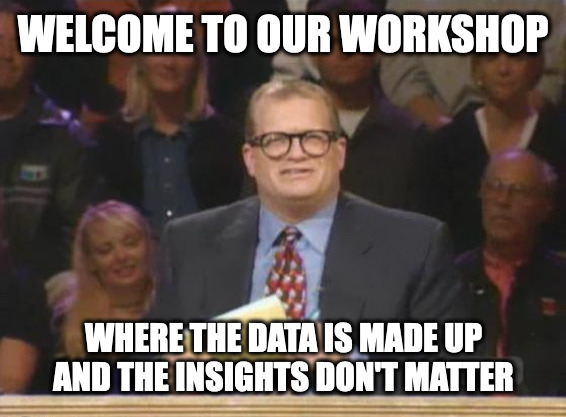

# Datasets

## Synthetic Mobility

We're using a synthetic mobility dataset, generated using an internal tool. The dataset has 10 billion records in London and NYC in 2022 with 3 million unique signals. Entities are generated independently and either dwell at a sampled OSM location or travel via a walking, cycling, or driving route to and from sampled OSM locations. The synthetic mobility data generator uses [Open Source Routing Machine](https://project-osrm.org/) (OSRM) and OSM data to find the paths between locations. Normally distributed noise is added to both the coordinates and timestamps. Sampling noise is added by randomly deleting 50-90% of the data.

At the macro scale, it reflects mobility data rather well. At the micro scale, it's about as good as DALL-E is with fingers.

## OpenStreetMap

[OpenStreetMap](https://www.openstreetmap.org/#map=5/50.766/8.877) (OSM) is a free and open source geographic database updated and maintained by volunteers. OSM is a lot of things, you've probably seen OSM map building outlines in CARTO's map tiles and other online maps.

We'll be using the OSM buildings datasets downloaded from [geofabrik](https://download.geofabrik.de/) in Greater London and NYC as our location dataset. There are ~2M building geometries, with ~1M geometries in London and ~1M geometries in NYC.

Geometries for 48 Blank Street Coffee locations have been extracted into a separate file.

- osm-london-nyc - [https://d3ftlhu7xfb8rb.cloudfront.net/london_nyc_osm.geoparquet](https://d3ftlhu7xfb8rb.cloudfront.net/london_nyc_osm.geoparquet)
- osm-bsc - [https://d3ftlhu7xfb8rb.cloudfront.net/blank_street_coffee_callsigns.geoparquet](https://d3ftlhu7xfb8rb.cloudfront.net/blank_street_coffee_callsigns.geoparquet)
