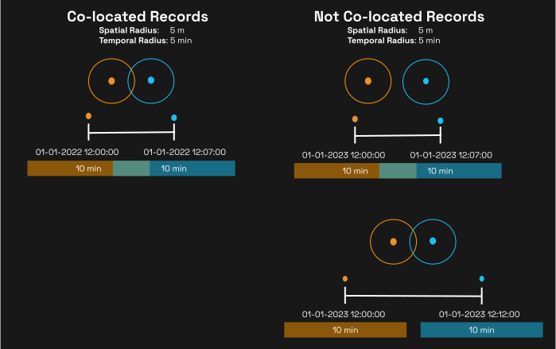
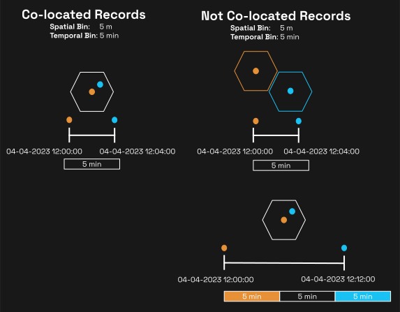

# A Dynamic Spatial-Temporal Analysis

[](https://mybinder.org/v2/gh/thegeneralsystem/sdsc-2023-workshop/main?labpath=notebooks%2F3_spatiotemporal_analysis.ipynb)

```admonish warning title="DFI Queries Will Not Work"
The Data Flow Index server used for this workshop is no longer running.  The workshop materials are left up _as is_ but queries will not run.  If you would like to trial the Data Flow Index please reach out to General System at [https://www.generalsystem.com/contact-us](https://www.generalsystem.com/contact-us).
```

> **First Law of Geography**
>
> _"everything is related to everything else, but near things are more related than distant things."_

**Question:** _Is BSC a place where people sit alone and work / read / focus or a place where people socialize?_

**Method:** Of people who visit BSC locations, identify their social network and check if they meetup with anyone in their social network at a BSC.

→ Define social network as those who are often co-dwelling in space + time.

## Co-locations

### I. Space-Time Buffers



We perform a spatiotemporal join by creating a buffer in both space and time around every record and then finding all other entities within the buffers.

- A spatiotemporal join.
- False negatives depend on the number of vertices used to create circle polygon.
- This approach become infeasible as the number of records an entity has increases.

In relational algebra:

$$
\mathbf{x} = \sigma(\mathbf{s} \cap \mathbf{t})(\text{GS}_{\text{id}=\text{uid}} \bowtie \text{GS})
$$

Where:

- $ \text{GS} $ is a table of records in the General System environment.
- $ \text{GS}_\text{uid} = \sigma_{\text{id}=\text{uid}}(\text{GS}) $ is the subset of records belonging to `uid`.
- $ \mathbf{s} \cap \mathbf{t} $ are co-located records in space and time.
- $ \mathbf{s} = (s_i - \Delta s <= s_i <= s_i + \Delta s) $ are the records within each spatial buffer.
- $ \mathbf{t} = (t_i - \Delta t <= t_i <= t_i + \Delta t) $ are the records within each time buffer.

### II. Hex-Period Bins



Use H3 and set time periods to create discrete, non-overlapping space-time bins.

- Approximates a spatiotemporal join.
- False negatives occur if 2 records are near one another but fall into separate bins.
- False positive occur if 2 records are far apart but fall into the same bin.
- Reduces number of queries required. Instead of a query per record, we can do a query per hex-period bin

In relational algebra:

$$
\mathbf{x} = \sigma(\mathbf{h} \cap \mathbf{p})(\text{GS}_{\text{id}=\text{uid}} \bowtie \text{GS})
\\\
\\\
\mathbf{u} = \Pi_{\text{uid, hp}}(\mathbf{x})
\\\
\\\
\sum^n_{n=1} {_\text{uid}} \mathbb{G}_{\textbf{count}(\text{uid})}(\mathbf{u})
$$

1. SELECT the subset of records in dataset `GS` belonging to `uid` indexed into H3 and time period.
2. Project into `[uid, hp]` dimensions.
3. GROUPBY `uid` COUNT records

Where:

- $ \text{GS} $ is a table of records in the General System environment.
- $ \text{GS}_\text{uid} = \sigma_{\text{id}=\text{uid}}(\text{GS}) $ is the subset of records belonging to `uid`.
- $ \mathbf{h} \cap \mathbf{p} $ are co-located records in space and time.
- $ \mathbf{h} = (x_i \in h_i) $ are the records within each H3 hexagon.
- $ \mathbf{p} = (x_i \in p_i) $ are the records within each time period.
- $ \text{hp} $ is the hex-period bin.

## Code

```python
def hex_period_colocations(
    uid: str,
    time_interval: Optional[Tuple[datetime, datetime]],
    resolution: int,
    period: int
) -> pd.DataFrame:

    uid_df = dfi.get.records(entities=[uid], time_interval=time_interval)

    # Nothing can be co-located to nothing
    if len(uid_df) == 0:
        return []

    # Create the hex-period bins and remove duplicates
    hex_period_df = (
        uid_df
        .assign(
            hex_id=lambda df: [
                h3.geo_to_h3(lat, lon, resolution) for lat, lon in zip(df.latitude, df.longitude)
            ],
            period_start=lambda df: df.timestamp.dt.round(f"{period}min"),
        )
        .drop_duplicates(subset=["hex_id", "period_start"])
        .assign(
            period_end=lambda df: df.period_start + timedelta(minutes=period),
            geometry=lambda df: df.hex_id.map(
                functools.partial(h3.h3_to_geo_boundary, geo_json=True)
            ).map(Polygon),
        )
        .sort_values(by="period_start", ascending=True)
    )

    # Find the value counts of co-located entities in each hex-period bin
    colocated_entities = Counter()
    for _, row in tqdm(hex_period_df.iterrows(), total=len(hex_period_df), desc="Space-Time Bin", disable=False):
        entities = dfi.get.entities(
            polygon=list(row.geometry.exterior.coords),
            time_interval=(row.period_start, row.period_end)
        )

        colocated_entities += Counter(entities)

    return colocated_entities
```

## Co-Locations

```python
start_time = datetime(2022, 1, 1, 0, 0, 0)
end_time = datetime(2022, 1, 15, 1, 0, 0)
time_interval = (start_time, end_time)
resolution = 8
period = 15
uid = "65b753d2-b523-467f-9c39-bc0fd6e2393b"

colocated = hex_period_colocations(uid=uid, time_interval=time_interval, resolution=resolution, period=period)
```

## Co-Locations at BSC Shops

```python
colocated_at_bsc = hex_period_colocations_at_bsc(
    uid=uid, osm_ids=bsc_ids, resolution=resolution, period=period, time_interval=time_interval
)
```

## Devices that are Co-Located at BSC and Elsewhere

```python
colocated & colocated_at_bsc
```

$notes$

- 1st Law of Geography - Waldo Tobler
  - ask audience if they agree
  - ask audience if this also applies to time

$notes-end$
