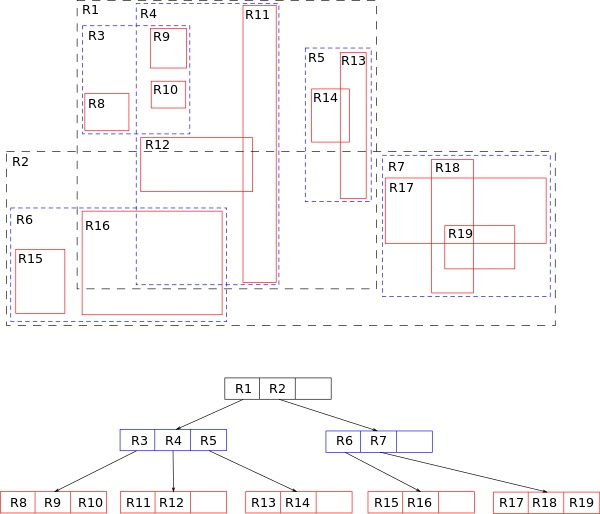
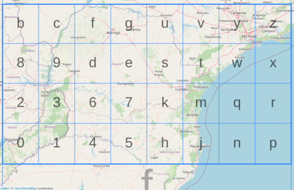
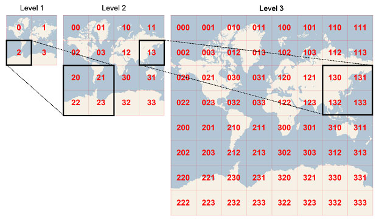
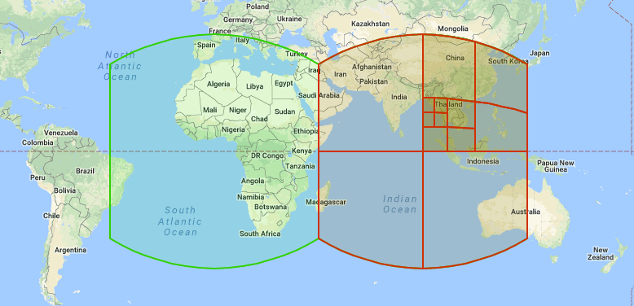

# Geospatial Indexes

Working with big datasets can get difficult and expensive. Even more so with large geospatial data models. Even even more more so with spatiotemporal data models.

Many systems can create an index on the spatial attribute to work through some of these challenges. Common spatial indexes include:

<table style="border:none; border-collapse: collapse; border-spacing: 0; cellspacing: 0; cellpadding: 0">
    <tr>
        <td>
        

            <a href="https://en.wikipedia.org/wiki/R-tree">Rtree</a>
        

        </td>
        <td>
         

            Tree data structures used for spatial access methods, i.e., for indexing multi-dimensional information such as geographical coordinates, rectangles or polygons.
        

        </td>
        <td>
            <a href="https://en.wikipedia.org/wiki/File:R-tree.svg"> 
            </td>
            </a> 
    </tr>
        <tr>
        <td>
        

            <a href="https://en.wikipedia.org/wiki/Military_Grid_Reference_System">MGRS</a>
        

        </td>
        <td>
         

            The geocoordinate standard used by NATO militaries for locating points on Earth.
        

        </td>
        <td>
            <a href="https://en.wikipedia.org/wiki/File:Universal_Transverse_Mercator_zones.svg"> 
            </td>
            </a>
    </tr>
        </tr>
        <tr>
        <td>
        

            <a href="https://en.wikipedia.org/wiki/Geohash">GeoHash</a>
        

        </td>
        <td>
         

            Encodes a geographic location into a short string of letters and digits.
        

        </td>
        <td>
            <a href="https://en.wikipedia.org/wiki/File:Geohash-grid.png"> 
            </td>
            </a>
    </tr>
    </tr>
        </tr>
        <tr>
        <td>
        

            <a href="https://learn.microsoft.com/en-us/bingmaps/articles/bing-maps-tile-system">Quadbins</a>
        

        </td>
        <td>
         

            Tesselates the world into hierarchical square bins (in Mercator projection). 
        

        </td>
        <td>
            <a href="https://learn.microsoft.com/en-us/bingmaps/articles/media/5cff54de-5133-4369-8680-52d2723eb756.jpg"> 
            </td>
            </a>
    </tr>
    </tr>
        </tr>
        <tr>
        <td>
        

            <a href="https://s2geometry.io/">Google's S2</a>
        

        </td>
        <td>
         

            Tesselates the world into hiearchical <a href="https://en.wikipedia.org/wiki/Hilbert_curve">Hilbert curves</a>.
        

        </td>
        <td>
            <a href="https://s2geometry.io/devguide/img/s2hierarchy.gif"> 
            </td>
            </a>
    </tr>
    </tr>
        </tr>
        <tr>
        <td>
        

            <a href="https://www.uber.com/en-GB/blog/h3/">Uber's H3</a>
        

        </td>
        <td>
         

            Tesselates the world into hierarchical hexbins.
        

        </td>
        <td>
            <a href="http://eng.uber.com/wp-content/uploads/2018/06/image12.png"> 
            </td>
            </a>
    </tr>
</table>

## Further Reading

- Carto's documentation on [Spatial indexes](https://docs.carto.com/data-and-analysis/analytics-toolbox-for-bigquery/key-concepts/spatial-indexes) are some comparisons of the commonly used indexes for large geospatial data. With H3 being the being the geospatial tool _du jour_ of SDSC 2023 London
- H3's documentation includes some [comparisons](https://h3geo.org/docs/comparisons/s2) with other geospatial indexes.

$notes$
Audience Questions:

- Who here knows what an index is?
- Who here is familiar with H3?
- Who here knows what I mean when I say 'Multidimensional Index'?

Extra Information

- Rtree - GeoPandas used to use an Rtree for it’s spatial index but now uses a variant called the STRtree.
- Quadbins - Based off Microsoft’s Quadkeys used in Bing Maps Tile System.
- Except for the Rtree, these indexes also geocode coordinates.

$notes-end$
