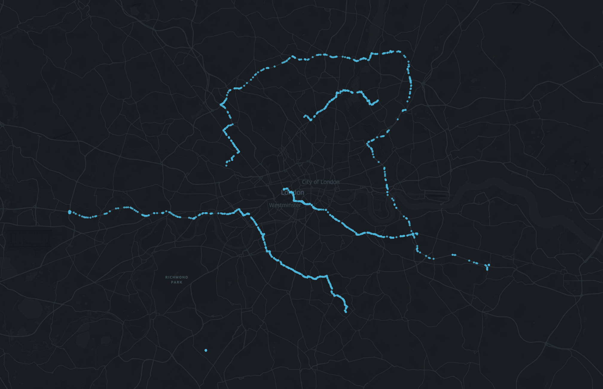
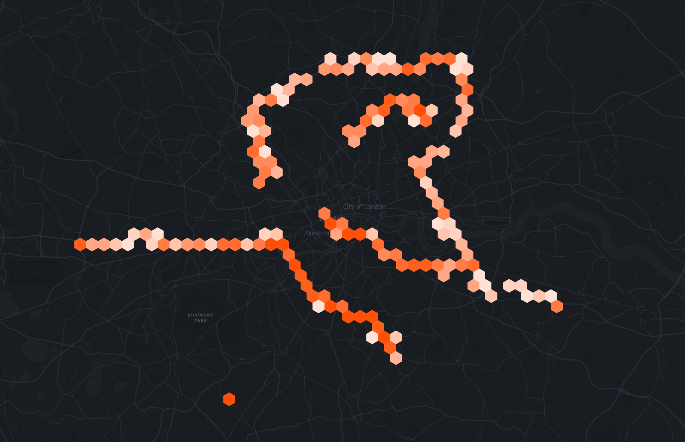
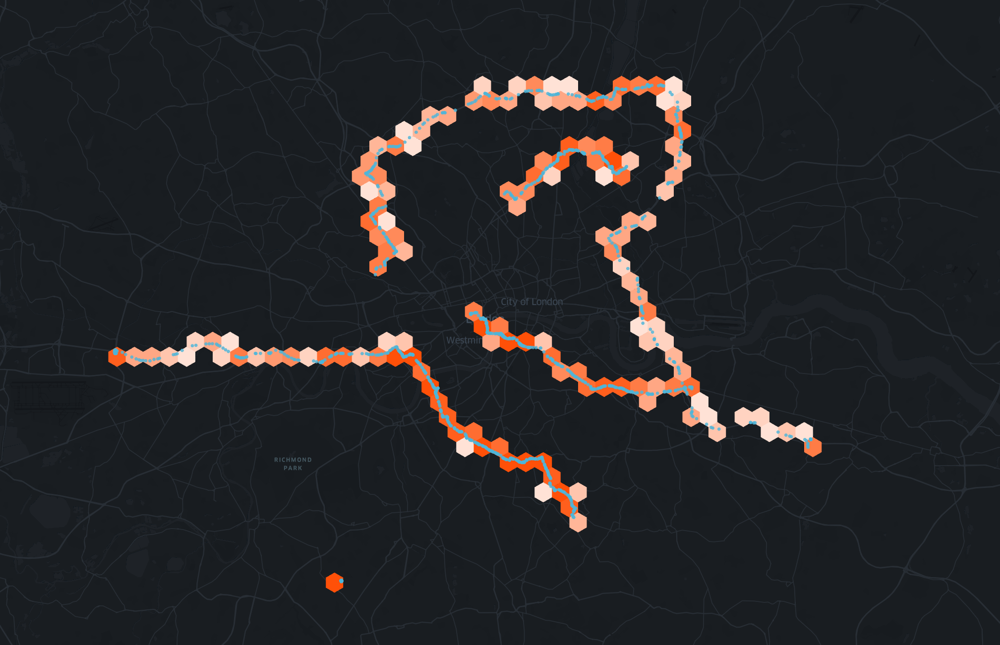

# Tradeoffs

## I. Simple

Once projected into a single dimension via a discretized index, can be consumed by traditional database indexes.

| latitude   | longitude | h3              |
| ---------- | --------- | --------------- |
| -73.990818 | 40.749105 | 892a100d2c3ffff |
| -73.991822 | 40.749917 | 892a100d2c3ffff |
| -73.992334 | 40.751730 | 892a100d2dbffff |
| -73.993220 | 40.751839 | 892a100d2dbffff |
| -73.995400 | 40.753001 | 892a1072537ffff |

## II. Loses Accuracy / Fidelity

  
  
  <input type="range" class="c-rng c-compare__range" min="0" max="100" value="50" oninput="this.parentNode.style.setProperty('--value', `${this.value}%`)" />

## III. Good for Anonymization

